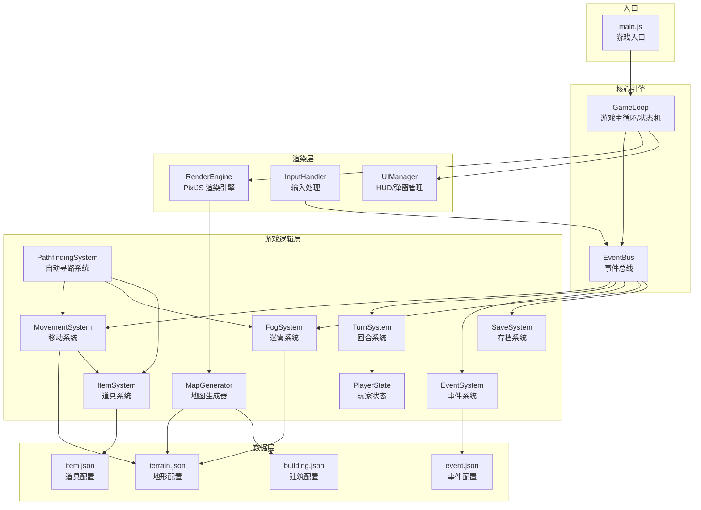
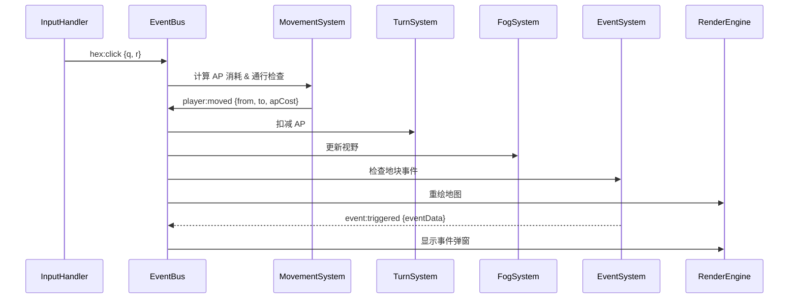

# 技术设计文档 — HexWanderer（六边形浪游者）

## 概述

HexWanderer 是一款基于 H5 的六边形地块探索 Roguelike 游戏。本设计文档描述了游戏的技术架构、核心模块接口、数据模型和测试策略。

### 技术栈

- **渲染引擎**: PixiJS v7+（Canvas/WebGL 自动切换）
- **编程语言**: 纯 JavaScript (ES6+)，无框架依赖
- **UI 样式**: HTML + Tailwind CSS (CDN)
- **数据驱动**: JSON 配置文件（地形、建筑、道具、事件）
- **存储**: localStorage（自动存档）+ JSON 导入导出（手动存档）
- **构建**: 无构建工具，直接 ES Module 加载，开发阶段使用本地 HTTP 服务器

### 设计原则

1. **数据驱动**: 地形、建筑、道具、事件全部通过 JSON 配置定义，游戏逻辑与内容数据分离
2. **模块化**: 各系统（地图生成、移动、事件、渲染等）独立模块，通过明确接口通信
3. **可扩展**: 预留道具触发时机、效果计算、战斗模块等扩展接口
4. **跨平台**: 适配桌面浏览器和移动端浏览器，预留小程序/App 适配能力
5. **性能优先**: 视口裁剪渲染、素材预加载缓存、避免不必要的重绘

---

## 架构

### 整体架构图



### 项目目录结构

```
hex-wanderer/
├── index.html                  # 入口 HTML
├── assets/                     # 素材资源
│   ├── terrain/                # 地形素材图片
│   ├── building/               # 建筑素材图片
│   ├── item/                   # 道具素材图片
│   └── ui/                     # UI 素材图片
├── config/                     # JSON 数据配置
│   ├── terrain.json            # 地形类型配置
│   ├── building.json           # 建筑类型配置
│   ├── item.json               # 道具类型配置
│   └── event.json              # 事件类型配置
├── src/                        # 源代码
│   ├── main.js                 # 游戏入口
│   ├── core/                   # 核心引擎
│   │   ├── GameLoop.js         # 游戏主循环/状态机
│   │   ├── EventBus.js         # 事件总线
│   │   └── ConfigLoader.js     # 配置加载器
│   ├── map/                    # 地图相关
│   │   ├── HexGrid.js          # 六边形网格数学工具
│   │   ├── MapGenerator.js     # 地图生成器（噪声+种子）
│   │   └── MapData.js          # 地图数据结构
│   ├── systems/                # 游戏系统
│   │   ├── MovementSystem.js   # 移动与 AP 消耗
│   │   ├── TurnSystem.js       # 回合管理
│   │   ├── EventSystem.js      # 事件触发与处理
│   │   ├── FogSystem.js        # 战争迷雾
│   │   ├── ItemSystem.js       # 道具管理
│   │   ├── BuildingSystem.js   # 建筑效果
│   │   ├── SaveSystem.js       # 存档管理
│   │   ├── PlayerState.js      # 玩家状态
│   │   └── PathfindingSystem.js # 自动寻路
│   ├── render/                 # 渲染层
│   │   ├── RenderEngine.js     # PixiJS 渲染主控
│   │   ├── LayerManager.js     # 五层渲染管理
│   │   ├── Camera.js           # 视口/相机控制
│   │   ├── AssetLoader.js      # 素材预加载与缓存
│   │   └── HexRenderer.js      # 六边形绘制工具
│   ├── ui/                     # UI 层
│   │   ├── UIManager.js        # UI 总管理
│   │   ├── HUD.js              # 状态栏 HUD
│   │   ├── DialogManager.js    # 事件弹窗
│   │   └── InputHandler.js     # 输入事件处理
│   └── utils/                  # 工具函数
│       ├── SeededRandom.js     # 种子随机数生成器
│       ├── SimplexNoise.js     # 简单噪声算法
│       └── HexMath.js          # 六边形坐标数学
└── tests/                      # 测试
    ├── unit/                   # 单元测试
    └── property/               # 属性测试
```

### 模块通信机制

系统间通过 **EventBus（事件总线）** 解耦通信。各模块发布/订阅事件，避免直接依赖。

核心事件流：



---

## 组件与接口

### 1. HexGrid — 六边形网格数学工具

负责六边形坐标系的所有数学运算。使用 Axial Coordinates (q, r) 坐标系，尖顶六边形（pointy-top）布局。

```javascript
class HexGrid {
  /** 获取 (q,r) 的 6 个相邻坐标 */
  static neighbors(q, r) → [{q, r}, ...]

  /** 两个六边形之间的距离（格数） */
  static distance(q1, r1, q2, r2) → number

  /** axial 坐标转像素坐标（用于渲染） */
  static hexToPixel(q, r, size) → {x, y}

  /** 像素坐标转 axial 坐标（用于点击检测） */
  static pixelToHex(x, y, size) → {q, r}

  /** 获取指定中心点、指定半径内的所有六边形坐标 */
  static hexesInRange(q, r, radius) → [{q, r}, ...]

  /** 判断坐标是否在地图边界内 */
  static isInBounds(q, r, mapWidth, mapHeight) → boolean
}
```

### 2. MapGenerator — 地图生成器

基于种子的确定性地图生成，使用 Simplex Noise 生成自然地形。

```javascript
class MapGenerator {
  constructor(seed, size, terrainConfig, buildingConfig, itemConfig)

  /** 生成完整地图数据 */
  generate() → MapData

  /** 从 JSON 加载预设地图 */
  static fromPreset(jsonData) → MapData

  /** 验证地图可达性（BFS/DFS），确保出生点到所有关键地块可达 */
  validateReachability(mapData) → {valid: boolean, unreachable: [{q,r}]}

  /** 放置圣物碎片（地图极值坐标处） */
  placeRelics(mapData) → void

  /** 放置建筑（遵循配置约束） */
  placeBuildings(mapData) → void

  /** 放置道具事件（确保道具与地形匹配） */
  placeItems(mapData) → void
}
```

### 3. MovementSystem — 移动系统

处理移动 AP 消耗计算、通行检查和摔伤判定。

```javascript
class MovementSystem {
  constructor(terrainConfig, itemSystem, playerState)

  /** 计算从 from 到 to 的 AP 消耗 */
  calculateAPCost(from, to) → number

  /** 检查是否可以移动到目标地块 */
  canMoveTo(from, to) → {allowed: boolean, reason?: string, requiredItem?: string}

  /** 执行移动，返回移动结果（含摔伤判定） */
  executeMove(from, to) → {success: boolean, apCost: number, damage?: number, damageType?: string}

  /** 获取海拔差 */
  getElevationDelta(from, to) → number

  /** 获取地形基础 AP 消耗 */
  getTerrainBaseCost(terrainType) → number
}
```

### 4. TurnSystem — 回合系统

管理回合流转、AP 回复、休息效果和剩余 AP 处理。

```javascript
class TurnSystem {
  constructor(playerState, terrainConfig, itemSystem, eventBus)

  /** 开始新回合：恢复 AP、结算过夜事件 */
  startNewTurn() → {turnNumber: number, apRestored: number, overnightEvents: []}

  /** 结束当前回合：处理剩余 AP、触发休息效果 */
  endTurn() → {restEffect: object, apCarryOver: number, hpChange: number}

  /** 计算当前地块的休息效果 */
  calculateRestEffect(tileData) → {hpChange: number, apBonus: number, statusEffects: []}

  /** 处理剩余 AP（丢弃/转化/结转） */
  handleRemainingAP(remainingAP) → {converted: boolean, hpGain?: number, apCarried?: number}

  /** 获取当前有效 AP 上限（含道具/状态修正） */
  getEffectiveAPMax() → number
}
```

### 5. EventSystem — 事件系统

管理事件触发、分支选择和事件刷新。

```javascript
class EventSystem {
  constructor(eventConfig, terrainConfig, buildingConfig, playerState, eventBus)

  /** 触发地块事件 */
  triggerEvent(tileData) → EventInstance | null

  /** 处理玩家选择分支 */
  resolveChoice(eventInstance, choiceIndex) → EventResult

  /** 检查是否满足分支条件（道具、HP 等） */
  checkBranchConditions(branch, playerState) → boolean

  /** 刷新事件（每 30 回合） */
  refreshEvents(mapData, currentTurn) → [{q, r, eventId}]

  /** 获取地块可触发的事件列表（基于地形权重） */
  getAvailableEvents(terrainType, buildingType?) → [eventId]
}
```

### 6. FogSystem — 迷雾系统

管理三态迷雾和视野计算。

```javascript
class FogSystem {
  constructor(terrainConfig, playerState, itemSystem)

  /** 计算玩家视野点数 VP（基础 2 + 道具 + 建筑加成） */
  calculateVisionPoints(playerPos, mapData) → number

  /** 使用 BFS + VP 计算可见地块（高海拔和森林消耗额外 VP） */
  getVisibleTiles(playerPos, mapData) → [{q, r}]

  /** 计算视野范围（向后兼容，返回 VP 值） */
  calculateVisionRange(playerPos, mapData) → number

  /** 更新迷雾状态（玩家移动后调用） */
  updateFog(playerPos, mapData) → void

  /** 获取地块可见状态 */
  getTileVisibility(q, r) → 'unexplored' | 'explored' | 'visible'

  /** 获取当前视野内所有地块 */
  getVisibleTiles(playerPos, mapData) → [{q, r}]
}
```

### 7. SaveSystem — 存档系统

管理游戏状态的序列化、反序列化和版本兼容。

```javascript
class SaveSystem {
  constructor(gameVersion)

  /** 序列化完整 GameState 为 JSON 字符串 */
  serialize(gameState) → string

  /** 反序列化 JSON 字符串为 GameState */
  deserialize(jsonString) → {success: boolean, state?: GameState, error?: string}

  /** 验证 GameState 数据完整性 */
  validate(gameState) → {valid: boolean, errors: [string]}

  /** 自动存档到 localStorage */
  autoSave(gameState) → void

  /** 从 localStorage 加载自动存档 */
  loadAutoSave() → GameState | null

  /** 版本迁移：旧版存档升级到新版 */
  migrate(oldState, fromVersion, toVersion) → GameState
}
```

### 8. ItemSystem — 道具系统

管理道具持有、启用/禁用和效果查询。

```javascript
class ItemSystem {
  constructor(itemConfig)

  /** 添加道具到玩家背包 */
  addItem(itemId) → boolean

  /** 检查是否持有某道具（且已启用） */
  hasActiveItem(itemId) → boolean

  /** 检查是否持有某道具（不论启用状态） */
  hasItem(itemId) → boolean

  /** 切换道具启用/禁用状态 */
  toggleItem(itemId) → boolean

  /** 交换道具（事件中使用） */
  exchangeItem(giveItemId, receiveItemId) → boolean

  /** 获取所有已启用道具的效果汇总 */
  getActiveEffects() → {terrainPass: [], apBonus: number, visionBonus: number, ...}

  /** 获取玩家持有的所有道具列表 */
  getInventory() → [{itemId, name, quality, enabled, effects}]

  /** 消耗一个道具（从背包移除） */
  consumeItem(itemId) → boolean

  /** 检查并执行道具组合（获得新道具时自动调用） */
  checkCombinations() → { combined: boolean, result?: string, consumed?: [string, string] }
}
```

### 9. BuildingSystem — 建筑系统

管理建筑效果触发和传送阵逻辑。

```javascript
class BuildingSystem {
  constructor(buildingConfig, eventBus)

  /** 触发建筑效果（玩家进入时） */
  triggerBuildingEffect(buildingData, playerState) → BuildingResult

  /** 获取传送阵配对目标 */
  getTeleportTarget(buildingId) → {q, r} | null

  /** 获取建筑对周围地块的影响（如灯塔视野加成） */
  getAreaEffect(buildingData, radius) → {affectedTiles: [{q,r}], effect: object}
}
```

### 10. RenderEngine — 渲染引擎

基于 PixiJS 的五层渲染管理，含视口裁剪和素材缓存。

```javascript
class RenderEngine {
  constructor(pixiApp, assetLoader, camera)

  /** 初始化五层 Container */
  initLayers() → void

  /** 渲染可见区域的地图 */
  renderVisibleTiles(mapData, fogSystem, camera) → void

  /** 更新玩家位置渲染 */
  updatePlayerPosition(q, r) → void

  /** 更新迷雾层渲染 */
  updateFogLayer(fogSystem) → void

  /** 高亮选中地块 */
  highlightTile(q, r) → void

  /** 显示地块信息面板 */
  showTileInfo(tileData) → void
}
```

### 11. Camera — 视口/相机控制

处理地图拖拽、缩放和视口计算。

```javascript
class Camera {
  constructor(viewportWidth, viewportHeight)

  /** 平移视口 */
  pan(dx, dy) → void

  /** 缩放视口 */
  zoom(factor, centerX, centerY) → void

  /** 平滑移动到指定位置 */
  panTo(x, y, duration) → Promise

  /** 获取当前视口内的六边形坐标范围 */
  getVisibleHexRange(hexSize) → {minQ, maxQ, minR, maxR}

  /** 屏幕坐标转世界坐标 */
  screenToWorld(screenX, screenY) → {x, y}
}
```

### 12. InputHandler — 输入处理

统一处理鼠标和触屏输入，发布事件到 EventBus。

```javascript
class InputHandler {
  constructor(pixiApp, camera, eventBus)

  /** 初始化输入监听（鼠标 + 触屏） */
  init() → void

  /** 处理地块点击 */
  onHexClick(q, r) → void  // 发布 hex:click 事件

  /** 处理拖拽开始/移动/结束 */
  onDragStart/onDragMove/onDragEnd → void

  /** 处理缩放（滚轮 + 双指） */
  onZoom(factor, center) → void
}
```

### 13. PlayerState — 玩家状态

集中管理玩家所有状态数据。

```javascript
class PlayerState {
  constructor()

  // 属性
  position: {q, r}
  hp: number
  hpMax: number
  ap: number
  apMax: number
  turnNumber: number
  relicsCollected: number
  gold: number
  statusEffects: [{id, duration, effect}]

  /** 应用伤害（含免疫判定） */
  applyDamage(amount, source) → {actualDamage: number, immunized: boolean}

  /** 回复 HP */
  heal(amount) → number

  /** 添加状态效果 */
  addStatusEffect(effect) → void

  /** 回合开始时更新状态效果（减少持续时间等） */
  tickStatusEffects() → [{expired: effectId}]

  /** 导出为可序列化对象 */
  toJSON() → object

  /** 从对象恢复 */
  static fromJSON(data) → PlayerState
}
```

### 14. PathfindingSystem — 自动寻路系统

基于 A* 算法的最短路径计算，以 AP 消耗为权重，考虑道具对通行和消耗的影响。

```javascript
class PathfindingSystem {
  /**
   * @param {import('./MovementSystem.js').MovementSystem} movementSystem
   * @param {import('./FogSystem.js').FogSystem} fogSystem
   * @param {import('./ItemSystem.js').ItemSystem} itemSystem
   * @param {import('../map/MapData.js').MapData} mapData
   */
  constructor(movementSystem, fogSystem, itemSystem, mapData)

  /**
   * 使用 A* 算法计算从 start 到 goal 的最短路径。
   * 权重 = 每步的实际 AP 消耗（含道具修正）。
   * 仅在已探索地块上规划，未探索地块视为不可通行。
   * 不回避摔伤风险路线（摔伤是概率性的）。
   *
   * @param {{q:number, r:number}} start - 起点坐标
   * @param {{q:number, r:number}} goal - 目标坐标
   * @returns {{ found: boolean, path: Array<{q:number, r:number}>, totalAP: number, stepCosts: number[] } | { found: false, reason: string }}
   */
  findPath(start, goal)

  /**
   * 计算路径上当前 AP 能走到的最远位置索引。
   * @param {Array<{q:number, r:number}>} path - 完整路径
   * @param {number[]} stepCosts - 每步 AP 消耗
   * @param {number} currentAP - 当前可用 AP
   * @returns {number} 最远可达的路径索引（0-based，0 = 第一步）
   */
  getReachableIndex(path, stepCosts, currentAP)

  /**
   * 检查从 from 到 to 是否可通行（考虑道具）。
   * 复用 MovementSystem.canMoveTo 的逻辑。
   * @param {object} fromTile
   * @param {object} toTile
   * @returns {boolean}
   */
  isPassable(fromTile, toTile)

  /**
   * 计算从 from 到 to 的 AP 消耗（考虑道具修正）。
   * 复用 MovementSystem.calculateAPCost 的逻辑。
   * @param {object} fromTile
   * @param {object} toTile
   * @returns {number}
   */
  getStepCost(fromTile, toTile)
}
```

#### A* 算法设计

```
输入: start(q,r), goal(q,r), mapData, fogSystem, movementSystem
输出: { found, path[], totalAP, stepCosts[] }

1. openSet = 优先队列（按 f = g + h 排序）
2. 将 start 加入 openSet，g(start) = 0
3. h(n) = HexGrid.distance(n, goal) × 1（启发式：六边形距离 × 最小AP消耗）

WHILE openSet 非空:
  current = openSet 中 f 值最小的节点
  IF current == goal: 回溯路径，返回结果

  FOR EACH neighbor of current:
    - 跳过未探索地块（fogSystem.getTileVisibility != explored/visible）
    - 跳过不可通行地块（movementSystem.canMoveTo 返回 false）
    - tentative_g = g(current) + movementSystem.calculateAPCost(current, neighbor)
    - IF tentative_g < g(neighbor):
        更新 g(neighbor), 设置 parent(neighbor) = current
        将 neighbor 加入/更新 openSet

RETURN { found: false, reason: '目标不可达' }
```

#### GameLoop 集成

```
自动移动状态机（新增 STATES.AUTO_MOVING）:

1. 玩家点击远端已探索地块
   → PathfindingSystem.findPath(playerPos, clickedPos)
   → 成功: 渲染路径高亮 + 显示"出发"按钮
   → 失败: toast "目标不可达"

2. 玩家点击"出发"
   → state = AUTO_MOVING
   → 逐步执行 _tryMove(nextStep)
   → 每步间隔 ~1 秒（无事件时）
   → 遇到事件/建筑: 暂停，处理完继续
   → 被传送: 清除路径
   → AP 耗尽: 停止，保留剩余路径
   → 玩家点击其他地块/取消: 停止，清除路径

3. 过夜后
   → 如有保留路径: 从当前位置重新计算到目标的路径
   → 显示"继续出发"按钮

4. 存档
   → 保存 pathTarget: {q, r} | null
   → 读档后重新计算路径
```

#### 路径渲染

```
路径高亮（与选中高亮区分）:
- 选中高亮: 黄色边框 (#ffeb3b), lineStyle 2px
- 路径高亮: 青色半透明填充 (#00bcd4, alpha 0.3)
- 当前回合可达部分: 青色较亮 (alpha 0.4)
- 超出当前回合 AP 的部分: 青色较暗 (alpha 0.15)
- 目标地块: 青色边框 (#00bcd4, lineStyle 2px)

路径信息 toast:
- "路径: X 步 | 总 AP: Y | 本回合可走: Z 步"
```

---

## 数据模型

### GameState — 完整游戏状态

```json
{
  "version": "1.0.0",
  "seed": 12345,
  "mapSize": "medium",
  "turnNumber": 15,
  "player": {
    "position": {"q": 0, "r": 0},
    "hp": 85,
    "hpMax": 100,
    "ap": 3,
    "apMax": 5,
    "relicsCollected": 1,
    "items": [
      {"itemId": "rope_claw", "enabled": true},
      {"itemId": "parachute", "enabled": true}
    ],
    "statusEffects": [
      {"id": "poison", "duration": 2, "effect": {"apCostModifier": 1}}
    ]
  },
  "map": {
    "tiles": {
      "0,0": {"terrain": "grass", "elevation": 3, "building": null, "event": null, "fogState": "visible"},
      "1,0": {"terrain": "forest", "elevation": 5, "building": "lighthouse", "event": null, "fogState": "explored"},
      "0,1": {"terrain": "water", "elevation": 2, "building": null, "event": "chest_01", "fogState": "unexplored"}
    },
    "relicPositions": [{"q": -20, "r": 0}, {"q": 15, "r": -18}, {"q": 5, "r": 20}],
    "portalPosition": {"q": 10, "r": -5},
    "teleportPairs": [
      [{"q": 3, "r": 7}, {"q": -8, "r": 12}]
    ]
  }
}
```

### Terrain_Config — 地形配置 (terrain.json)

```json
{
  "terrainTypes": {
    "grass": {
      "name": "草地",
      "baseCost": 1,
      "requiredItem": null,
      "restEffect": {"hpChange": 5, "apBonus": 0},
      "visionModifier": 0,
      "overnightEventChance": 0.05,
      "overnightEvents": ["wolf_attack", "stargazing"],
      "enterDamage": 0,
      "enterDamageChance": 0,
      "statusOnEnter": null,
      "statusOnEnterChance": 0,
      "waterEntry": false,
      "waterExitCostExtra": 0,
      "eventWeights": {"combat": 0.3, "treasure": 0.4, "choice": 0.3},
      "refreshChance": 0.02,
      "sprites": {
        "variants": ["assets/terrain/grass_1.png", "assets/terrain/grass_2.png", "assets/terrain/grass_3.png"],
        "rule": "random",
        "highElevation": {
          "variants": ["assets/terrain/grass_snow.png"],
          "rule": "random"
        }
      },
      "elevationSpriteThreshold": 8
    },
    "water": {
      "name": "水域",
      "baseCost": 1,
      "requiredItem": "boat",
      "restEffect": {"hpChange": 2, "apBonus": 0},
      "visionModifier": 1,
      "waterEntry": true,
      "waterExitCostExtra": 1,
      "sprites": {
        "default": "assets/terrain/water.png"
      }
    },
    "swamp": {
      "name": "沼泽",
      "baseCost": 2,
      "requiredItem": null,
      "restEffect": {"hpChange": -5, "apBonus": 0, "statusEffect": "poison"},
      "visionModifier": -1,
      "statusOnEnter": "poison",
      "statusOnEnterChance": 0.2,
      "sprites": {
        "default": "assets/terrain/swamp.png"
      }
    },
    "lava": {
      "name": "熔岩",
      "baseCost": 2,
      "requiredItem": "fire_boots",
      "enterDamage": 20,
      "enterDamageChance": 1.0,
      "restEffect": {"hpChange": -15},
      "sprites": {
        "default": "assets/terrain/lava.png"
      }
    }
  }
}
```

### Building_Config — 建筑配置 (building.json)

```json
{
  "buildingTypes": {
    "lighthouse": {
      "name": "灯塔",
      "description": "增加周围地块视野",
      "effect": {"visionBonus": 3, "areaRadius": 3},
      "allowedTerrains": ["grass", "desert", "forest"],
      "adjacencyConstraints": {"forbidden": []},
      "triggerEvent": null,
      "sprite": "assets/building/lighthouse.png"
    },
    "camp": {
      "name": "营地",
      "description": "休息时额外恢复 AP",
      "effect": {"restApBonus": 2, "restHpBonus": 10},
      "allowedTerrains": ["grass", "forest", "desert"],
      "adjacencyConstraints": {"forbidden": ["monster_camp"]},
      "sprite": "assets/building/camp.png"
    },
    "portal": {
      "name": "传送门",
      "description": "收集齐圣物碎片后通关",
      "effect": {"type": "win_condition"},
      "allowedTerrains": ["grass", "desert"],
      "sprite": "assets/building/portal.png"
    },
    "teleporter": {
      "name": "传送阵",
      "description": "传送到配对的传送阵",
      "effect": {"type": "teleport"},
      "allowedTerrains": ["grass", "desert", "forest"],
      "sprite": "assets/building/teleporter.png"
    },
    "ruin": {
      "name": "遗迹",
      "description": "触发探索事件",
      "effect": {"type": "trigger_event"},
      "triggerEvent": "ruin_explore",
      "allowedTerrains": ["grass", "desert", "forest"],
      "sprite": "assets/building/ruin.png"
    }
  }
}
```

### Item_Config — 道具配置 (item.json)

```json
{
  "items": {
    "rope_claw": {
      "name": "钩爪",
      "description": "允许攀爬海拔差 >3 的悬崖",
      "quality": "rare",
      "effects": [
        {"type": "terrain_pass", "condition": "elevationDelta > 3"}
      ],
      "sprite": "assets/item/rope_claw.png"
    },
    "parachute": {
      "name": "降落伞",
      "description": "免疫下坡摔伤，允许通过悬崖",
      "quality": "rare",
      "effects": [
        {"type": "fall_immunity"},
        {"type": "terrain_pass", "condition": "elevationDelta <= -4"}
      ],
      "sprite": "assets/item/parachute.png"
    },
    "boat": {
      "name": "船只",
      "description": "允许进入水域",
      "quality": "uncommon",
      "effects": [
        {"type": "terrain_pass", "terrainType": "water"}
      ],
      "sprite": "assets/item/boat.png"
    },
    "telescope": {
      "name": "望远镜",
      "description": "永久增加 2 格视野",
      "quality": "uncommon",
      "effects": [
        {"type": "vision_bonus", "value": 2, "permanent": true}
      ],
      "sprite": "assets/item/telescope.png"
    },
    "leather_shoes": {
      "name": "皮靴",
      "description": "AP 上限 +1",
      "quality": "common",
      "effects": [
        {"type": "ap_max_bonus", "value": 1, "permanent": true}
      ],
      "sprite": "assets/item/leather_shoes.png"
    },
    "tent": {
      "name": "帐篷",
      "description": "休息时额外回复 10 HP",
      "quality": "common",
      "effects": [
        {"type": "rest_hp_bonus", "value": 10}
      ],
      "sprite": "assets/item/tent.png"
    },
    "four_leaf_clover": {
      "name": "四叶草",
      "description": "概率免疫伤害（伤害越高概率越低）",
      "quality": "epic",
      "effects": [
        {"type": "damage_immunity_chance", "formula": "max(0, 0.5 - damage * 0.01)"}
      ],
      "sprite": "assets/item/clover.png"
    },
    "antidote": {
      "name": "解毒药",
      "description": "抵消中毒效果",
      "quality": "common",
      "effects": [
        {"type": "status_immunity", "statusId": "poison"}
      ],
      "sprite": "assets/item/antidote.png"
    }
  }
}
```

### Event_Config — 事件配置 (event.json)

```json
{
  "events": {
    "chest_01": {
      "type": "treasure",
      "title": "神秘宝箱",
      "description": "你发现了一个古老的宝箱...",
      "choices": [
        {
          "text": "打开宝箱",
          "conditions": [],
          "outcomes": [
            {"probability": 0.7, "result": {"type": "item_reward", "itemPool": ["tent", "antidote"]}},
            {"probability": 0.3, "result": {"type": "hp_change", "value": -10, "message": "宝箱是个陷阱！"}}
          ]
        },
        {
          "text": "用钩爪小心撬开",
          "conditions": [{"type": "has_item", "itemId": "rope_claw"}],
          "outcomes": [
            {"probability": 1.0, "result": {"type": "item_reward", "itemPool": ["telescope", "leather_shoes"]}}
          ]
        },
        {
          "text": "离开",
          "conditions": [],
          "outcomes": [
            {"probability": 1.0, "result": {"type": "nothing"}}
          ]
        }
      ]
    },
    "wolf_attack": {
      "type": "combat",
      "title": "狼群突袭",
      "description": "一群饥饿的狼从暗处扑来！⚠️ 此战斗可能致命",
      "deathWarning": true,
      "choices": [
        {
          "text": "迎战",
          "conditions": [],
          "outcomes": [
            {"probability": 0.6, "result": {"type": "hp_change", "value": -15, "message": "你击退了狼群，但受了伤"}},
            {"probability": 0.4, "result": {"type": "hp_change", "value": -40, "message": "狼群凶猛，你身负重伤"}}
          ]
        },
        {
          "text": "逃跑",
          "conditions": [],
          "outcomes": [
            {"probability": 0.7, "result": {"type": "ap_change", "value": -2, "message": "你成功逃脱，但消耗了体力"}},
            {"probability": 0.3, "result": {"type": "hp_change", "value": -20, "message": "逃跑时被咬伤"}}
          ]
        }
      ]
    }
  }
}
```

### 素材清单

#### 素材规范

| 类别 | 尺寸 | 形状 | 格式 | 文件大小上限 | 风格说明 |
|---|---|---|---|---|---|
| 地形 | 148×128 px | 尖顶六边形区域填满，外部透明（提供方形也可，程序裁剪） | PNG 透明背景 | 50KB | 俯视角，平铺纹理，边缘可自然衔接 |
| 建筑 | 96×96 px | 正方形画布，内容居中，周围透明 | PNG 透明背景 | 30KB | 略带 2.5D 透视感图标，在地形上方清晰辨认 |
| 道具 | 64×64 px | 正方形画布，内容居中，周围透明 | PNG 透明背景 | 20KB | 图标风格，简洁清晰，缩小后可辨认 |
| UI | 64×64 px | 正方形画布，内容居中，周围透明 | PNG 透明背景 | 20KB | 同道具风格 |

#### 多变体素材支持

每种素材可提供多个变体文件，渲染时根据规则选择：

- 命名规则：`{名称}_{变体编号}.png`，如 `grass_1.png`、`grass_2.png`、`grass_3.png`
- 无变体时使用原始文件名即可，如 `grass.png`
- 选择规则（在配置中定义）：
  - `"random"`：基于地块坐标的种子随机选择（同一地块每次渲染结果一致）
  - `"elevation"`：根据海拔值选择变体
  - `"adjacent"`：根据相邻地块类型选择变体（用于边缘过渡）
- 配置示例：`"sprites": {"variants": ["grass_1.png", "grass_2.png", "grass_3.png"], "rule": "random"}`

#### 地形素材 (assets/terrain/)

| 文件名 | 说明 | 尺寸 | 状态 |
|---|---|---|---|
| grass.png | 草地 | 148×128 | ✅ 已生成 |
| grass_snow.png | 高海拔草地（雪地） | 148×128 | ✅ 已生成 |
| desert.png | 荒漠 | 148×128 | ✅ 已生成 |
| desert_snow.png | 高海拔荒漠（雪地） | 148×128 | ✅ 已生成 |
| water.png | 水域 | 148×128 | ✅ 已生成 |
| forest.png | 森林（海拔≥5） | 128×153 | ✅ 已生成（高素材，底边对齐） |
| forest_deep.png | 低海拔深色森林（海拔<5） | 128×153 | ✅ 已生成（高素材，底边对齐） |
| forest_snow.png | 高海拔雪松林 | 128×153 | ✅ 已生成（高素材，底边对齐） |
| swamp.png | 沼泽 | 148×128 | ✅ 已生成 |
| lava.png | 熔岩 | 148×128 | ✅ 已生成 |
| ice.png | 浮冰 | 148×128 | ✅ 已生成 |

#### 建筑素材 (assets/building/)

| 文件名 | 说明 | 状态 |
|---|---|---|
| camp.png | 营地 | ✅ 已生成 |
| lighthouse.png | 灯塔 | ✅ 已生成 |
| city.png | 城市 | ✅ 已生成 |
| ruin.png | 遗迹 | ✅ 已生成 |
| portal.png | 传送门 | ✅ 已生成 |
| teleporter-1~5.png | 传送阵（5种变体，配对使用） | ✅ 已生成 |
| cave.png | 洞穴 | ✅ 已生成 |
| farm.png | 农田 | ✅ 已生成 |
| mine.png | 矿坑 | ✅ 已生成 |
| monster_camp.png | 怪物营地 | ✅ 已生成 |
| whirlpool.png | 漩涡 | ✅ 已生成 |
| church.png | 教堂 | ✅ 已生成 |
| watchtower.png | 瞭望塔 | ✅ 已生成 |
| reef.png | 暗礁 | ✅ 已生成 |
| training_ground.png | 训练场 | ✅ 已生成 |
| altar.png | 祭坛 | ✅ 已生成 |
| spring.png | 泉水 | ✅ 已生成 |
| wishing_well.png | 许愿池 | ✅ 已生成 |
| phone_booth.png | 废弃电话亭 | ✅ 已生成 |
| food_truck.png | 路边餐车 | ✅ 已生成 |
| bonfire.png | 孤独的篝火 | ✅ 已生成 |
| hollow_tree.png | 树洞 | ✅ 已生成 |
| colossus_hand.png | 巨像之手 | ✅ 已生成 |
| vending_machine.png | 自动贩卖机 | ✅ 已生成 |
| village.png | 村庄 | ✅ 已生成 |
| castle.png | 城堡 | ✅ 已生成 |

#### 道具素材 (assets/item/)

| 文件名 | 说明 | 品质 | 状态 |
|---|---|---|---|
| rope_claw.png | 钩爪 | rare | ✅ 已生成 |
| parachute.png | 降落伞 | rare | ✅ 已生成 |
| boat.png | 船只 | uncommon | ✅ 已生成 |
| fire_boots.png | 防火靴 | uncommon | ✅ 已生成 |
| telescope.png | 望远镜 | uncommon | ✅ 已生成 |
| leather_shoes.png | 皮靴 | common | ✅ 已生成 |
| tent.png | 帐篷 | common | ✅ 已生成 |
| clover.png | 四叶草 | epic | ✅ 已生成 |
| antidote.png | 解毒药 | common | ✅ 已生成 |
| helmet.png | 安全帽 | common | ✅ 已生成 |
| resurrection_cross.png | 重生十字架 | rare | ✅ 已生成 |
| bomb.png | 炸弹 | uncommon | ✅ 已生成 |
| garlic.png | 大蒜 | common | ✅ 已生成 |
| wolfsbane.png | 狼毒草 | uncommon | ✅ 已生成 |
| smoke_bomb.png | 烟雾弹 | uncommon | ✅ 已生成 |
| mystery_egg.png | 神秘蛋 | uncommon | ✅ 已生成 |
| hunting_dog.png | 猎犬 | rare | ✅ 已生成 |
| car.png | 越野车 | epic | ✅ 已生成 |
| feather.png | 羽毛 | common | ✅ 已生成 |
| sword.png | 长剑 | uncommon | ✅ 已生成 |
| strange_gem.png | 奇异宝石 | uncommon | ✅ 已生成 |
| compass.png | 指南针 | uncommon | ✅ 已生成 |
| old_scroll.png | 古老卷轴 | common | ✅ 已生成 |
| blue_sweater.png | 蓝色毛衣 | common | ✅ 已生成 |
| water_cup.png | 水杯 | common | ✅ 已生成 |
| mask.png | 面具 | uncommon | ✅ 已生成 |
| briefcase.png | 公文包 | uncommon | ✅ 已生成 |
| shovel.png | 铲子 | common | ✅ 已生成 |
| stick.png | 木棍 | common | ✅ 已生成 |
| torch.png | 火把 | common | ✅ 已生成 |
| pearl.png | 珍珠 | uncommon | ✅ 已生成 |
| pharaoh_scepter.png | 法老权杖 | epic | ✅ 已生成 |
| camper_van.png | 房车 | epic | ✅ 已生成 |
| glider.png | 滑翔翼 | epic | ✅ 已生成 |
| drill.png | 钻头 | rare | ✅ 已生成 |
| mega_torch.png | 巨型火把 | rare | ✅ 已生成 |
| master_sword.png | 大师之剑 | epic | ✅ 已生成 |
| treasure_map.png | 藏宝图 | rare | ✅ 已生成 |
| elixir.png | 万能药 | legendary | ✅ 已生成 |
| diplomat_kit.png | 外交官套装 | legendary | ✅ 已生成 |
| pharaoh_codex.png | 法老法典 | legendary | ✅ 已生成 |
| black_pearl.png | 黑珍珠号 | legendary | ✅ 已生成 |
| vest.png | 防弹衣 | uncommon | ✅ 已生成 |
| chainmail.png | 锁子甲 | rare | ✅ 已生成 |
| shield.png | 盾牌 | uncommon | ✅ 已生成 |
| bio_suit.png | 防化服 | rare | ✅ 已生成 |
| climbing_gloves.png | 攀岩手套 | uncommon | ✅ 已生成 |
| witch_broom.png | 女巫扫帚 | epic | ✅ 已生成 |
| fan.png | 扇子 | common | ✅ 已生成 |
| earphone.png | 耳机 | uncommon | ✅ 已生成 |
| whip.png | 鞭子 | rare | ✅ 已生成 |
| cowboy_hat.png | 牛仔帽 | uncommon | ✅ 已生成 |
| straw_doll.png | 稻草人 | common | ✅ 已生成 |
| thief_medal.png | 盗贼印记 | uncommon | ✅ 已生成 |
| sheriff_badge.png | 治安官徽章 | uncommon | ✅ 已生成 |
| hoe.png | 锄头 | common | ✅ 已生成 |
| marigold.png | 金盏花 | common | ✅ 已生成 |
| accordion.png | 手风琴 | uncommon | ✅ 已生成 |
| magnet.png | 磁铁 | uncommon | ✅ 已生成 |
| sickle.png | 镰刀 | common | ✅ 已生成 |
| lava_core.png | 熔岩核心 | epic | ✅ 已生成 |
| salted_fish.png | 咸鱼 | common | ✅ 已生成 |
| beast_flute.png | 唤兽笛 | epic | ✅ 已生成 |
| balloon.png | 气球 | common | ✅ 已生成 |

#### UI 素材 (assets/ui/)

| 文件名 | 说明 | 状态 |
|---|---|---|
| player.png | 玩家角色（支持水平翻转表示方向） | ✅ 已生成 |
| event_marker.png | 事件标记（选择/通用事件） | ✅ 已生成 |
| monster_marker.png | 怪物标记（战斗事件） | ✅ 已生成 |
| treature_marker.png | 宝箱标记（宝箱/拾取事件） | ✅ 已生成 |
| relic.png | 圣遗物碎片（HUD 显示用） | ✅ 已生成 |
| gold.png | 金币（HUD 显示用） | ✅ 已生成 |
| logo.png | 游戏 Logo（浏览器 favicon） | ✅ 已生成 |
| debuff_poison.png | 中毒状态图标 | ✅ 已生成 |
| debuff_frostbite.png | 冻伤状态图标 | ✅ 已生成 |
| debuff_curse.png | 诅咒状态图标 | ✅ 已生成 |
| debuff_bleed.png | 流血状态图标 | ✅ 已生成 |
| debuff_vision.png | 视障状态图标 | ✅ 已生成 |

#### 素材统计

| 类别 | 总数 | 已生成 | 未生成 |
|---|---|---|---|
| 地形 | 11 | 11 | 0 |
| 建筑 | 26 | 26 | 0 |
| 道具 | 64 | 64 | 0 |
| UI | 12 | 12 | 0 |
| **合计** | **113** | **113** | **0** |

---
