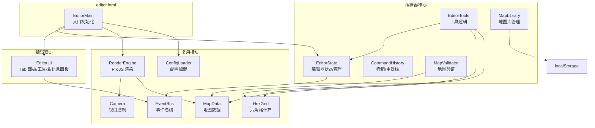
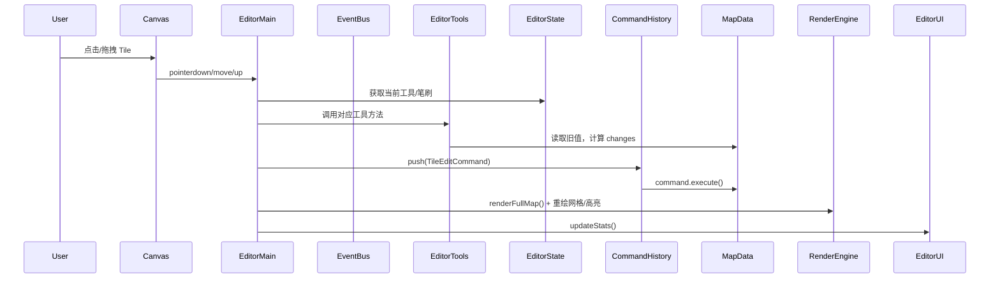

# 技术设计文档：地图编辑器 (Map Editor)

## 概述

为 HexWanderer 添加一个独立的可视化六角格地图编辑器，运行在 `editor.html` 页面中。编辑器复用现有的渲染引擎（RenderEngine、HexRenderer、Camera）和数据结构（MapData、HexGrid），提供地形绘制、海拔调整、建筑放置、事件配置、圣物事件放置、起始位置设置、撤销/重做、地图验证、文件导入导出、本地地图库等功能。

编辑器采用 MVC 风格架构：`EditorState` 管理编辑器状态，`EditorTools` 封装各种编辑工具的逻辑，`EditorUI` 负责 HTML 面板交互（Tab 布局），`RenderEngine` 负责画布渲染。模块间通过 `EventBus` 解耦通信。

### 设计决策与理由

1. **独立页面而非嵌入游戏**：编辑器作为 `editor.html` 独立运行，避免与游戏逻辑耦合，同时复用渲染和数据模块。
2. **复用 RenderEngine + Camera**：编辑器的地图渲染和视口控制与游戏完全一致，减少重复代码。编辑器关闭迷雾层（`fogEnabled = false`），并在 decoration 层添加网格线和编辑器高亮标记。
3. **命令模式实现撤销/重做**：每次编辑操作封装为 Command 对象，包含 `execute()` 和 `undo()` 方法，支持高效的历史管理。
4. **无打包工具**：与现有项目一致，使用 ES Module + script 标签加载 PixiJS。
5. **纯 CSS 样式**：编辑器不使用 Tailwind CSS，使用纯 CSS 编写样式（内联 style 或 `<style>` 标签），与游戏深色主题一致（`#1a1a2e` 背景、`#eee` 文字、`#4fc3f7` 强调色等）。
6. **MapData.toJSON/fromJSON 作为序列化核心**：编辑器的导出/导入和地图库存储都基于 MapData 现有的序列化方法，确保与游戏存档系统兼容。
7. **Tab 布局工具面板**：工具面板分为地块/建筑/事件三个 Tab 页，避免单一长滚动面板，提升操作效率。
8. **事件配置替代自动放置**：编辑器不直接在地图上自动放置大世界事件，而是通过 eventConfig（enabled、treasureDensity、eventDensity）配置密度参数，游戏加载时按密度运行时生成事件。
9. **圣物事件替代圣物位置工具**：不再使用独立的 relic 工具切换 relicPositions，改为在事件 Tab 中放置 relic_guardian/relic_shrine/relic_trial 事件，画布上用 relic.png 图标标记。
10. **保存对话框**：保存到地图库前弹出对话框让用户输入名称和描述，而非直接保存。
11. **需求 18（预览模式/试玩）延后**：标记为低优先级，放到后续迭代中实现。

## 架构



### 文件结构

```
editor.html                          # 编辑器入口页面（含内联 CSS 样式）
src/editor/
  EditorMain.js                      # 编辑器初始化、画布输入、事件绑定、网格/高亮渲染
  EditorState.js                     # 编辑器状态（工具、笔刷、选中项、eventConfig、spawnPosition）
  EditorTools.js                     # 工具逻辑（地形笔刷、海拔、建筑、事件、橡皮擦、填充等）
  CommandHistory.js                  # 撤销/重做命令栈 + TileEditCommand
  MapValidator.js                    # 地图验证逻辑
  MapLibrary.js                      # 地图库 localStorage 管理
  EditorUI.js                        # 编辑器 UI（Tab 面板、工具栏、信息面板、对话框、Toast）
```

### 事件流



## 组件与接口

### EditorState

管理编辑器的全局状态。所有 setter 通过 EventBus 发布变更事件。

```javascript
class EditorState {
  constructor(eventBus) {
    this.eventBus = eventBus;
    this.currentTool = 'terrain';    // 'terrain' | 'elevation_up' | 'elevation_down' | 'elevation_set' | 'building' | 'event' | 'eraser' | 'fill' | 'select' | 'spawn'
    this.brushSize = 1;              // 1 | 2 | 3
    this.selectedTerrain = 'grass';
    this.selectedBuilding = null;
    this.selectedEvent = null;
    this.elevationValue = 5;         // 用于 elevation_set 模式，0-10
    this.gridVisible = true;
    this.previewMode = false;        // 预留，未实现
    this.mapMeta = { name: '', author: '', description: '' };
    this.eventConfig = { enabled: true, treasureDensity: 0.20, eventDensity: 0.35 };
    this.spawnPosition = null;       // { q, r } | null（null = 地图中心）
  }

  setTool(tool)              // emit('editor:tool-changed')
  setBrushSize(size)         // emit('editor:brush-changed')
  setSelectedTerrain(t)      // emit('editor:terrain-changed')
  setSelectedBuilding(b)     // emit('editor:building-changed')
  setSelectedEvent(e)        // emit('editor:event-changed')
  setElevationValue(v)       // clamp(0,10), emit('editor:elevation-changed')
  toggleGrid()               // emit('editor:grid-toggled')
  togglePreview()            // emit('editor:preview-toggled')
  setMapMeta(meta)           // emit('editor:meta-changed')
  setEventConfig(config)     // emit('editor:event-config-changed')
  setSpawnPosition(q, r)     // emit('editor:spawn-changed')
}
```

### CommandHistory

基于命令模式的撤销/重做系统。

```javascript
class CommandHistory {
  constructor(maxSize = 50)
  execute(command)   // 执行命令并压入 undoStack，清空 redoStack
  undo()             // 弹出 undoStack 顶部，调用 undo()，压入 redoStack
  redo()             // 弹出 redoStack 顶部，调用 execute()，压入 undoStack
  canUndo()          // boolean
  canRedo()          // boolean
  clear()            // 清空两个栈
}

class TileEditCommand {
  constructor(mapData, changes)  // changes: Array<{ q, r, before, after }>
  execute()  // 应用 after 状态
  undo()     // 恢复 before 状态
}
```

### EditorTools

封装各种编辑工具的核心逻辑。每个工具方法返回 changes 数组。

```javascript
class EditorTools {
  constructor(editorState, mapData, configs)

  getBrushTiles(q, r, brushSize)  // → [{q, r}, ...]
  paintTerrain(q, r)              // → changes[]
  adjustElevation(q, r, delta)    // → changes[]
  setElevation(q, r, value)       // → changes[]
  placeBuilding(q, r, buildingId) // → { changes[], warnings[] }
  eraseBuilding(q, r)             // → changes[]
  placeEvent(q, r, eventId)       // → changes[]
  eraseEvent(q, r)                // → changes[]
  toggleRelic(q, r)               // → { added, position }（保留但 UI 不再使用）
  floodFill(q, r, newTerrain)     // → changes[]（代码保留，UI 未暴露 fill 按钮）
  fillAll(newTerrain)             // → changes[]
}
```

注意：`fill` 工具的代码在 EditorTools 中保留，但 EditorUI 不再显示 fill 按钮。`toggleRelic` 同样保留但不再通过 UI 调用，圣物功能改为通过事件放置（relic_guardian/relic_shrine/relic_trial）实现。

### MapValidator

地图验证逻辑，检查地图是否满足游戏运行的基本要求。

```javascript
class MapValidator {
  constructor(configs)

  validate(mapData) → { valid: boolean, issues: ValidationIssue[] }

  _checkPortalExists(mapData)                          // 至少一个 portal
  _checkRelicCount(mapData)                            // relicPositions.length >= relicsNeeded
  _checkReachability(mapData)                          // BFS 从中心出发，所有非 void 可达
  _checkBuildingTerrainConstraints(mapData, config)    // allowedTerrains
  _checkTeleporterPairs(mapData)                       // teleporter 成对
}
```

### MapLibrary

管理 localStorage 中的自定义地图集合。

```javascript
class MapLibrary {
  constructor(storageKey = 'hexwanderer_map_library')

  save(id, customMap)     // 保存地图到 localStorage
  load(id)                // 加载地图
  delete(id)              // 删除地图
  list()                  // 返回所有地图的元信息列表 [{ id, meta }]
  generateId()            // 生成唯一 ID（map_timestamp_suffix）
}
```

### EditorUI

管理编辑器的 HTML UI，采用 Tab 布局。使用纯 CSS 内联样式，与游戏深色主题保持一致。

```javascript
class EditorUI {
  constructor(container, editorState, eventBus, configs)

  init()                           // 创建工具栏、Tab 面板、信息面板、Toast 容器
  updateInfoPanel(tileData)        // 更新地块信息显示
  updateStats(mapData)             // 更新地图统计和圣物计数
  showValidationResults(results)   // 显示验证结果
  showMapLibrary(maps)             // 显示地图库列表对话框
  showToast(message, type, duration) // Toast 通知
  showConfirmDialog(opts)          // 确认对话框 → Promise<boolean>
  destroy()                        // 清理 UI
}
```

#### Tab 面板结构

工具面板分为三个 Tab 页，通过 Tab 按钮切换，同一时间只显示一个 Tab 内容：

- **地块 Tab（🗺️ 地块）**：地形选择器（8 种地形色块）、笔刷大小（1/2/3）、海拔控制（升高/降低/设置为）、特殊工具（选择/橡皮擦/起始位置）
- **建筑 Tab（🏠 建筑）**：建筑列表，每项显示 sprite 图片 + 名称（来自 building.json 的 sprite 字段）
- **事件 Tab（📋 事件）**：事件配置面板（启用开关 + 宝箱/事件密度滑块）、事件选择器（按 combat/treasure/choice 分组，过滤掉 overnight_ 前缀和建筑触发事件）、圣物事件选择器（relic_guardian/relic_shrine/relic_trial）

#### 工具栏按钮

新建 | 随机生成 | 保存 | 地图库 | 导出 | 导入 | 验证 | 撤销 | 重做 | 网格 | 适应窗口

#### 对话框

- **新建地图对话框**：选择尺寸（小/中/大）
- **随机生成对话框**：输入种子和尺寸
- **保存对话框**：输入地图名称和描述，确认后 emit `editor:save-to-library`
- **地图库对话框**：列表显示已保存地图，支持加载和删除

### EditorMain

编辑器入口，负责初始化所有模块、画布输入处理、网格/高亮渲染、事件绑定。

主要职责：
1. 加载配置、创建 PixiJS Application、初始化 RenderEngine（fogEnabled=false）
2. 创建 EventBus、EditorState、CommandHistory、EditorTools、MapValidator、MapLibrary、EditorUI
3. 创建默认 25×25 草地地图
4. 绑定画布输入（点击绘制、拖拽绘制、悬停信息、触屏支持）
5. 绑定键盘快捷键（Ctrl+Z 撤销、Ctrl+Shift+Z/Ctrl+Y 重做）
6. 绑定 EventBus 事件（新建、随机生成、保存、加载、导入导出、验证、撤销重做、网格切换等）
7. 渲染网格线（decoration 层）和编辑器高亮（悬停、验证问题、圣物标记、起始位置标记）

### 编辑器输入处理

EditorMain 中实现画布输入处理：

- **点击**：根据当前工具执行操作（terrain/elevation/building/event/eraser 绘制，select 查看信息，spawn 设置起始位置）
- **拖拽绘制**：按住鼠标拖拽时连续执行工具操作，整个拖拽过程的 changes 合并为一个 TileEditCommand
- **Ctrl+Z / Ctrl+Shift+Z / Ctrl+Y**：撤销/重做
- **鼠标悬停**：更新信息面板
- **触屏**：单指绘制，双指平移/缩放（通过 _activeTouchCount 和 _isPinching 区分）

### 编辑器高亮渲染

EditorMain 的 `_renderEditorHighlights()` 在 decoration 层绘制：

- **悬停高亮**：半透明蓝色六角格
- **验证问题标记**：红色半透明六角格
- **圣物事件标记**：扫描所有 tile，对 event 以 `relic_` 开头的 tile 显示 relic.png 图标
- **起始位置标记**：在 spawnPosition（或默认地图中心）显示 player.png 图标

### 游戏加载自定义地图

在 `src/main.js` 的 `startNewGame()` 中：

1. 始终提供"导入地图文件"选项（文件选择器，支持 .hexmap.json）
2. 如果 MapLibrary 中有地图，额外提供"从地图库选择"选项
3. 选择自定义地图后用 `MapData.fromJSON()` 加载，跳过 MapGenerator
4. 如果 eventConfig.enabled 为 true，调用 `_placeRuntimeEvents()` 按密度自动生成大世界事件
5. 使用 spawnPosition 作为玩家起始位置（未设置时使用地图中心）
6. 缺少 portalPosition 时自动检测 portal 建筑 tile，仍无则回退到随机生成

#### 运行时事件生成（_placeRuntimeEvents）

`src/main.js` 中的 `_placeRuntimeEvents(mapData, configs, eventConfig, rng)` 函数：
- 遍历所有无事件、无建筑、非 void 的 tile
- 跳过距离 spawn 点 3 格以内的 tile
- 按 eventDensity 概率决定是否放置事件
- 按 treasureDensity 比例分配 treasure/combat/choice 类型
- 过滤掉 overnight_ 前缀和建筑触发事件
- 使用最少使用计数策略均匀分配事件

### 响应式设计

编辑器 UI 使用 CSS Flexbox 布局，支持桌面端和移动端：

- **桌面端**：左侧工具面板（固定宽度 ~220px）、中间画布区域（自适应）、右侧信息面板
- **移动端**：通过 `@media (max-width: 767px)` 媒体查询，工具面板折叠为底部抽屉，工具栏按钮隐藏文字仅显示图标
- 所有按钮最小触摸目标 44×44px
- Camera 已支持触屏拖拽和捏合缩放

## 数据模型

### Tile 数据结构

```javascript
{
  terrain: string,       // 'grass' | 'desert' | 'water' | 'forest' | 'swamp' | 'lava' | 'ice' | 'void'
  elevation: number,     // 0-10
  building: string|null, // building type ID or null
  event: string|null,    // event ID or null（包括 relic_guardian/relic_shrine/relic_trial）
  fogState: string       // 编辑器中不使用
}
```

### EditorState 数据

```javascript
{
  currentTool: string,       // 'terrain' | 'elevation_up' | 'elevation_down' | 'elevation_set' | 'building' | 'event' | 'eraser' | 'fill' | 'select' | 'spawn'
  brushSize: number,         // 1 | 2 | 3
  selectedTerrain: string,
  selectedBuilding: string | null,
  selectedEvent: string | null,
  elevationValue: number,    // 0-10
  gridVisible: boolean,
  previewMode: boolean,      // 预留
  mapMeta: { name: string, author: string, description: string },
  eventConfig: { enabled: boolean, treasureDensity: number, eventDensity: number },
  spawnPosition: { q: number, r: number } | null
}
```

### CustomMap（地图库存储格式）

```javascript
{
  id: string,
  meta: {
    name: string,
    author: string,
    description: string,
    createdAt: number,     // timestamp
    updatedAt: number,     // timestamp
    size: string           // 如 "25×25"
  },
  mapJSON: object,         // MapData.toJSON() 的输出
  eventConfig: { enabled: boolean, treasureDensity: number, eventDensity: number },
  spawnPosition: { q: number, r: number } | null
}
```

### MapFile（导出文件格式）

```javascript
{
  version: string,         // "1.0"
  meta: {
    name: string,
    author: string,
    description: string,
    createdAt: string,     // ISO 8601
    updatedAt: string
  },
  mapData: object,         // MapData.toJSON() 的输出
  eventConfig: { enabled: boolean, treasureDensity: number, eventDensity: number },
  spawnPosition: { q: number, r: number } | null
}
```

### ValidationIssue

```javascript
{
  type: string,            // 'no_portal' | 'insufficient_relics' | 'unreachable_tiles' | 'invalid_building_terrain' | 'unpaired_teleporter'
  severity: string,        // 'error' | 'warning'
  message: string,
  tiles: Array<{q, r}>
}
```

## 正确性属性 (Correctness Properties)

### Property 1: 默认地图初始化

*For any* 新建的默认地图（尺寸为 small/medium/large），地图中的每一个 tile 都应该具有 terrain = 'grass' 且 elevation = 5，且 tile 总数应等于 width × height。

**Validates: Requirements 1.2**

### Property 2: 地形笔刷绘制

*For any* 地形类型、任意有效的中心坐标 (q, r) 和笔刷大小 (1/2/3)，执行地形绘制后，以 (q, r) 为中心、brushSize-1 为半径的所有六角格的 terrain 属性都应等于选中的地形类型，且该范围之外的 tile 不受影响。

**Validates: Requirements 2.2, 2.5**

### Property 3: 海拔调整与边界钳制

*For any* tile 和任意调整方向（+1 或 -1），执行海拔调整后，tile 的 elevation 应等于 clamp(原始值 + delta, 0, 10)。对于直接设置模式，*for any* 目标值 v ∈ [0, 10]，设置后 elevation 应等于 v。

**Validates: Requirements 3.2, 3.3**

### Property 4: 建筑放置与替换

*For any* 建筑类型和任意 tile（其地形在该建筑的 allowedTerrains 中），执行建筑放置后，该 tile 的 building 属性应等于选中的建筑类型，无论该 tile 之前是否已有建筑。

**Validates: Requirements 4.2, 4.3**

### Property 5: Portal 位置不变量

*For any* 地图状态，如果地图中恰好有一个 tile 的 building 为 'portal'，则 mapData.portalPosition 应等于该 tile 的坐标。如果没有 portal 建筑，则 portalPosition 应为 null。

**Validates: Requirements 4.5**

### Property 6: Teleporter 配对不变量

*For any* 地图状态，mapData.teleportPairs 中的每一对坐标都应对应地图上实际存在的 teleporter 建筑，且每个 teleporter 建筑恰好属于一个配对。

**Validates: Requirements 4.6**

### Property 7: 建筑地形约束

*For any* 建筑类型和任意 tile，如果该 tile 的地形不在建筑的 allowedTerrains 列表中，则放置操作应被拒绝，tile 的 building 属性应保持不变。

**Validates: Requirements 4.7**

### Property 8: 事件放置

*For any* 事件标识符和任意有效 tile 坐标，执行事件放置后，该 tile 的 event 属性应等于选中的事件标识符。

**Validates: Requirements 5.2**

### Property 9: 圣物碎片切换往返

*For any* tile 坐标，对该位置执行两次圣物碎片切换操作后，relicPositions 数组应恢复到初始状态（即切换两次等于不变）。

**Validates: Requirements 6.2, 6.3**

### Property 10: 撤销/重做往返

*For any* 地图初始状态和任意编辑操作序列，执行所有操作后依次撤销所有操作，地图应恢复到初始状态。此外，撤销后再重做应恢复到撤销前的状态。

**Validates: Requirements 10.1, 10.2, 10.3**

### Property 11: 新编辑清除重做栈

*For any* 编辑器状态，如果执行了撤销操作使得重做栈非空，然后执行一个新的编辑操作，则重做栈应被清空（canRedo() 返回 false）。

**Validates: Requirements 10.5**

### Property 12: MapData 序列化往返

*For any* 有效的 MapData 对象（包含任意 tiles、relicPositions、portalPosition、teleportPairs），执行 toJSON() 然后 fromJSON() 应产生与原始对象等价的 MapData。

**Validates: Requirements 11.2, 11.3**

### Property 13: 无效导入拒绝

*For any* 非法 JSON 字符串（语法错误、缺少必要字段、tiles 为空等），导入操作应失败并返回错误信息，当前地图数据不受影响。

**Validates: Requirements 11.4**

### Property 14: 地图库存取往返

*For any* 有效的 CustomMap 对象，保存到 MapLibrary 后再加载，应产生与原始对象等价的地图数据。删除后，该地图应不再出现在列表中。

**Validates: Requirements 12.4, 12.5**

### Property 15: 地图验证正确性

*For any* 地图状态：(a) 如果没有 portal 建筑，验证应报告 'no_portal' 问题；(b) 如果 relicPositions.length < relicsNeeded，验证应报告 'insufficient_relics' 问题；(c) 如果存在不可达的非 void tile，验证应报告 'unreachable_tiles' 问题；(d) 如果建筑放置违反 allowedTerrains，验证应报告 'invalid_building_terrain' 问题；(e) 如果 teleporter 数量为奇数，验证应报告 'unpaired_teleporter' 问题。

**Validates: Requirements 15.2**

### Property 16: 洪水填充正确性

*For any* 地图、任意起始 tile (q, r) 和目标地形类型，洪水填充后：(a) 起始 tile 及其所有与起始 tile 原始地形相同且相连的 tile 都应变为目标地形；(b) 与起始 tile 不相连或原始地形不同的 tile 不受影响。

**Validates: EditorTools.floodFill（代码保留）**

### Property 17: 全部填充正确性

*For any* 地图和任意地形类型，执行全部填充后，地图中每一个 tile 的 terrain 属性都应等于指定的地形类型。

**Validates: EditorTools.fillAll（代码保留）**

## 错误处理

### 编辑操作错误

| 场景 | 处理方式 |
|------|---------|
| 点击地图边界外 | 忽略操作，不产生 Command |
| 建筑放置违反 allowedTerrains | 显示 toast 警告，阻止放置 |
| 海拔超出 [0, 10] 范围 | 自动钳制到边界值 |
| 撤销栈为空时执行撤销 | 忽略操作 |
| 重做栈为空时执行重做 | 忽略操作 |

### 文件操作错误

| 场景 | 处理方式 |
|------|---------|
| 导入的 JSON 语法错误 | 显示错误 toast，保留当前地图 |
| 导入的数据缺少必要字段（width/height/tiles） | 显示具体错误信息 |
| localStorage 写入失败（空间不足） | 显示 toast 建议导出文件并清理旧地图 |
| localStorage 读取失败 | 地图库显示为空 |

### 配置加载错误

| 场景 | 处理方式 |
|------|---------|
| terrain.json / building.json 等加载失败 | 显示错误信息，编辑器无法启动 |

### 游戏加载自定义地图错误

| 场景 | 处理方式 |
|------|---------|
| 自定义地图缺少 portalPosition | 自动检测 portal 建筑 tile，仍无则回退到随机生成 |
| 自定义地图 tiles 数据损坏 | 捕获异常，回退到随机生成 |
| MapData.fromJSON() 抛出异常 | 捕获异常，回退到随机生成 |

## 测试策略

### 双重测试方法

本功能采用单元测试和属性测试相结合的方式：

- **单元测试**：验证具体示例、边界情况和错误条件
- **属性测试**：验证跨所有输入的通用属性

### 属性测试配置

- **测试库**：fast-check（通过 CDN 加载）
- **每个属性测试最少运行 100 次迭代**
- **标签格式**：`Feature: map-editor, Property {number}: {property_text}`

### 单元测试范围

使用 `tests/test-runner.js` 框架，覆盖：

- EditorState 的工具切换和状态管理
- CommandHistory 的边界情况（空栈撤销、超过 50 步限制）
- MapValidator 的各种验证场景
- MapLibrary 的 CRUD 操作
- EditorTools 的边界情况（地图边缘、void 地形）
- 建筑放置的 allowedTerrains 校验
- 导入无效 JSON 的错误处理

### 属性测试范围

属性测试文件放在 `tests/property/` 目录下：

| 属性 | 测试文件 | 生成器 |
|------|---------|--------|
| Property 1-3 | `editor-tools.property.js` | 随机地形类型、坐标、笔刷大小、海拔值 |
| Property 4-8 | `editor-tools.property.js` | 随机建筑类型、事件 ID、tile 坐标 |
| Property 9 | `relic-toggle.property.js` | 随机 tile 坐标 |
| Property 10-11 | `command-history.property.js` | 随机编辑操作序列 |
| Property 12-13 | `serialization.property.js` | 随机 MapData |
| Property 14 | `map-library.property.js` | 随机 CustomMap 对象 |
| Property 15 | `map-validator.property.js` | 随机地图（含/不含各种问题） |
| Property 16-17 | `flood-fill.property.js` | 随机地图、随机起始点、随机目标地形 |

### 测试运行

测试通过 `tests/index.html` 在浏览器中运行。
